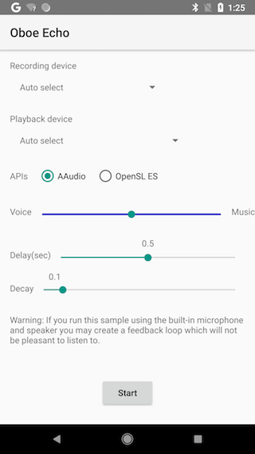

Echo Sample
============

This sample demonstrates how to loop back audio from input stream to output stream with simple processing:
- delays up to 1 second
- mixes with a pre-decoded PCM stream

Screenshots
-----------

### Stream Configurations
- 48kHz
- oboe::I16
- steroe or mono

Run time adjustable parameters on UI:
- delay time
- balance between live audio and background audio stream

### Main Concept
An internal audio buffer (circular buffer) is allocated and initialized with silence audio;
the size of the buffer is decided with: its playing time equals to the required delay time.

When live audio data coming in, this sample:
- copies audio in the saved audio buffer to out-going stream
- mixes the incoming stream (just recorded) with saved audio data
- saves these newly mixed audio data back into audio buffer

`    saved-audio = Incoming * ( 1.0 - decay ) + Echo * decay   `

### Caveats
When first time starting audio devices, the stream may not be stable.
The symtom is the strange callback pattern. This sample waits half a second
for audio system to stablize and playing silience during that period of time.

It is an estimate, it would vary on different platforms.

